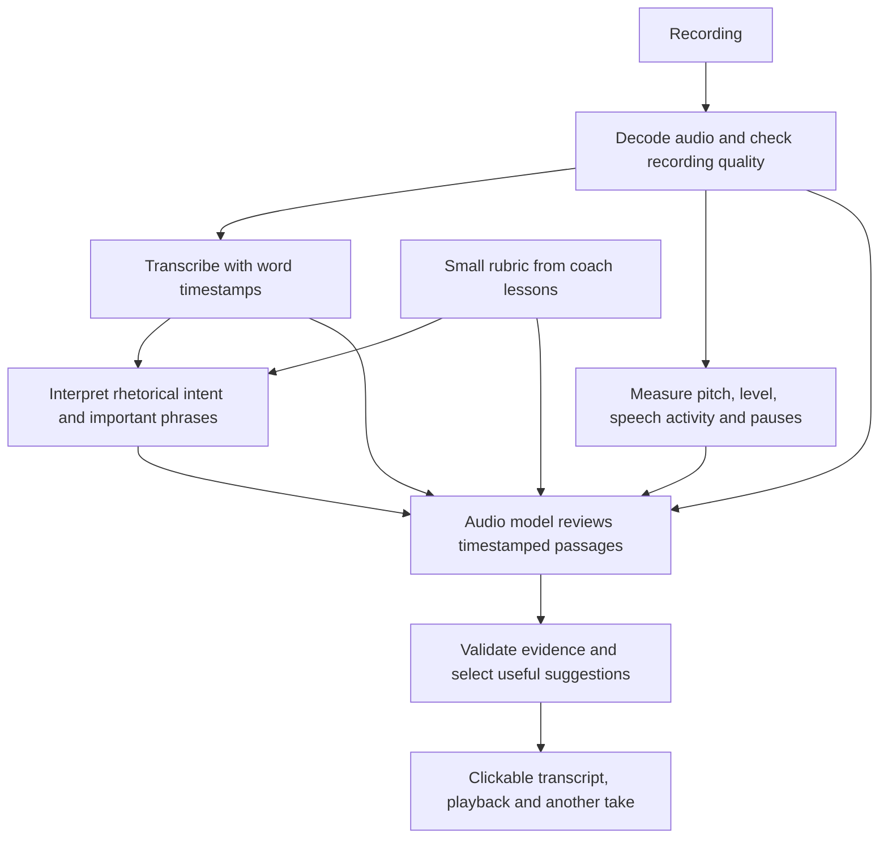

# Voice coaching MVP research

Research date: 25 September 2026. Scope: research and a local feasibility probe, not a finished application.

**Recommendation:** build an upload-and-review prototype using timestamped transcription, local acoustic measurements, and an audio-capable model supplied with a small rubric extracted from the coaching videos. Start with English, one speaker, and 30-second to 5-minute recordings. Apply the five lessons directly across speech purposes; archetypes and persona selection come later. No custom model training is needed to test the idea.

The central experiment is whether the system can identify a few useful moments and explain a specific improvement that a human listener agrees with. A fluent paragraph of generic coaching is not sufficient evidence.

## 1. Refine the proposed approach

The proposed transcript → intent/emotion → expected delivery → comparison is a good starting point. Make three changes:

1. **Infer local meaning cautiously.** Identify important points, complex explanations, transitions, and likely emotional meaning from the passage and its surroundings. Do not require an archetype or speaking-goal selection. Text alone does not uniquely determine intention: “That is wonderful” could be sincere, sarcastic, restrained, or comforting. When several readings fit, offer a conditional suggestion or omit it.
2. **Analyze the original audio alongside the text.** Transcription loses pitch, loudness, timing, voice quality, and sometimes repetitions. A text-only model cannot recover these reliably.
3. **Predict acceptable delivery choices, not one correct performance.** “Leave space after this important point” is more defensible than insisting on one exact pitch curve or emotional category. Separate what was measured from what the coach recommends.

The same sentence can have multiple good deliveries. Evaluate the coach's principles against the local meaning, retaining uncertainty about intent. Do not claim to discover the speaker's actual emotional state, personality, or confidence.

## 2. What the first product should do

Upload or record speech and see a transcript with clickable highlighted passages. There is no archetype setup step. Clicking a passage plays the relevant audio with a little surrounding context. Each feedback card contains:

- The passage and its original recording timestamps.
- One observation grounded in audio, such as a pace increase or a falling phrase ending.
- Why that might weaken the intended effect.
- One concrete instruction for another take.
- The related principle and timestamp from the coaching lesson.
- A visible uncertainty label when the interpretation is tentative.

Show at most three priority improvements and one successful moment initially. Include “That was intentional” and transcript correction. Re-recording the selected passage and comparing the two takes closes the coaching loop. Do not begin with an unexplained overall score.

**Illustrative feedback, not a result measured in this research:** “00:42–00:48: This is your main takeaway, but you accelerate through it and continue immediately. Try slowing the final phrase and leaving a short pause after it.”

Defer overlapping conversations, live interruption, automatic accent correction, clinical voice assessment, custom voice cloning, and universal emotion scoring. Accepting common file formats is feasible; reliable coaching on every possible recording is a later validation problem.

## 3. Recommended architecture

### A. Preserve and decode the recording

Use FFmpeg to decode supported inputs to PCM. Keep the original recording and original timeline. Use separate copies if ASR needs resampling or normalization; derive volume measurements from audio whose relative dynamics have not been altered. Never independently normalize each phrase before comparing levels.

Check for silence, clipping, severe noise, music, and overlapping speakers. If a measurement is unreliable, withhold that category or ask for a cleaner recording. Keep channel handling explicit: for a stereo interview, a channel may represent a different speaker.

### B. Transcribe and align

For the first hosted prototype, use **Deepgram Nova-3 prerecorded transcription** with word timing and utterances. Its documented utterance response includes word start/end times and confidence values. Retain original recognized words separately from any display formatting. [Deepgram utterances](https://developers.deepgram.com/docs/utterances)

**OpenAI `whisper-1`** is a straightforward alternative when requesting `verbose_json` with word timestamps. The current guide recommends `gpt-transcribe` for ordinary file transcription but specifically directs timestamp use cases to `whisper-1`; do not assume every transcription model has the same timing output. Uploads are limited to 25 MB, so extract/compress audio or chunk longer material. [OpenAI file transcription](https://developers.openai.com/api/docs/guides/speech-to-text)

If word boundaries are too inaccurate for highlighting or emphasis detection, add **forced alignment** against the audio. WhisperX combines ASR, voice activity detection, and phoneme alignment; its documented limitations include language-specific alignment support and some words, such as numbers, that cannot be aligned. Use phrase-level highlights when word alignment fails. [WhisperX](https://github.com/m-bain/whisperX), [WhisperX paper](https://arxiv.org/abs/2303.00747)

Do not erase silence from the canonical timeline. If processing chunks, store chunk offsets and map every result back to source time. Validate `0 <= start < end <= duration`. Correcting the transcript may require realignment before recomputing rate.

### C. Measure delivery

Use Python with **Praat/Parselmouth** and NumPy for the local prototype. Parselmouth exposes Praat's pitch and intensity analysis. Voice activity detection, for example Silero VAD, can provide speech regions; keep its original-time intervals. [Parselmouth API](https://parselmouth.readthedocs.io/en/stable/api_reference.html), [Silero VAD](https://github.com/snakers4/silero-vad)

| Dimension | Evidence to compute | How to use it | Important limitation |
|---|---|---|---|
| Rate | Words/minute in phrases and 5–10-second windows; variation across adjacent windows | Find rushed takeaways or consistently unvaried pacing | Counts depend on ASR and language; short windows are unstable |
| Pauses | Speech boundaries and silence intervals, checked against word timing | Find where an idea may need processing time or a transition needs separation | Breaths, stop consonants, hesitation, and deliberate silence are different |
| Volume | Short-time RMS in dBFS, relative change across comparable speech regions, clipping | Find fading endings and intentional or missing dynamic contrast | Recording gain, distance, compression, and automatic gain control alter the signal |
| Pitch/melody | Voiced F0 contour, robust pitch range, phrase-ending movement | Identify little melodic contrast or an unexpected contour on an important phrase | Pitch tracking can fail; a rise is not inherently wrong |
| Emphasis | Relative word duration, pitch movement, and level, jointly | Check whether intended keywords stand out | Stress cannot be reduced to loudness alone |
| Tonality | Audio-model descriptions of perceived warmth, energy, softness, or firmness | Offer a tentative interpretation tied to the passage's meaning | No single physical variable proves an emotional tone |

Use `WPM = 60 × word_count / phrase_elapsed_seconds`, including internal pauses. Report an additional articulation-rate estimate using speech-active duration if useful; label it separately. VAD settings change that estimate, so keep them fixed across comparisons.

Use `12 × log2(F0 / speaker_baseline_F0)` for relative pitch in semitones. Summarize robust percentiles over voiced frames, not silence or raw maxima. Start with a sufficiently broad pitch range, inspect octave errors, and tune to the recording; Praat documents why pitch floor and ceiling matter. [Praat pitch settings](https://www.fon.hum.uva.nl/praat/manual/Intro_4_2__Configuring_the_pitch_contour.html)

Loudness feedback should say “quieter than the surrounding passage,” not “you spoke at 50 dB SPL.” A normal uncalibrated recording does not establish physical room volume. A naturally high or low pitch is not a speaking defect. Compare the speaker with their own relevant baseline, not with the coach's absolute voice.

### D. Interpret context and review audio

Use an audio-capable **Gemini Flash** model as the first contextual reviewer, with an explicit model ID pinned in configuration. Google's current audio guide demonstrates `gemini-3.8-flash`, audio understanding, structured output, and timestamped segment analysis. This establishes an available integration route, not coaching accuracy. [Gemini audio understanding](https://ai.google.dev/gemini-api/docs/audio)

For short recordings, supply the full audio once, the transcript, rubric, and computed phrase features. Ask the model to refer to existing segment/word IDs; the server owns the actual timestamps and numerical measurements. If a second pass is needed, send only uncertain passages with surrounding context.

Use two logical stages, which can be combined into one call initially:

- An intent planner proposes rhetorical roles, important words, and acceptable delivery options from the text and surrounding passage. It records uncertainty and alternative readings; it does not assign an archetype.
- An audio reviewer compares the observed delivery with those options and the coach's rubric. It can return “no issue” or “insufficient evidence.”

Do not ask the model to invent precise WPM, decibels, or pitch values by listening. Supply computed measurements. Do not use model-generated timestamps as the canonical alignment. Treat all transcript content as data rather than instructions.

### E. Validate the feedback

The response should identify `segment_id`, `word_ids`, `dimension`, `rule_id`, `observed_feature_ids`, `interpretation`, `suggested_action`, and an uncertainty tier. The server attaches validated times and quotations. Reject nonexistent evidence, merge duplicate suggestions, and cap the number shown.

Keep separate confidence fields for transcript quality, acoustic reliability, and contextual interpretation. Model confidence is initially a heuristic, not a calibrated probability. If the acoustic evidence and model judgment disagree, prefer withholding a claim over fabricating certainty.

## 4. Tool choices and alternatives

| Tool | Role | Decision |
|---|---|---|
| Deepgram Nova-3 | Hosted timestamped ASR | Default for the first integrated MVP; test on our recordings |
| OpenAI Whisper API | Hosted ASR with word timing | Good alternative if OpenAI access is already available |
| faster-whisper | Local ASR | Used for this research; useful for avoiding audio uploads |
| WhisperX | Better alignment when needed | Add only if the initial timestamps fail evaluation |
| Praat/Parselmouth + NumPy | Physical delivery measurements | Use from the beginning |
| Gemini audio understanding | Context-aware listening and feedback | Test directly against the coaching examples |
| Hume Expression Measurement | Specialized expression features | Optional comparison experiment, not a required dependency |
| Wispr Flow | Dictation and text capture | Not the recommended backend for this job |

The [faster-whisper project](https://github.com/SYSTRAN/faster-whisper) supports word timestamps and integrated VAD. Local execution removes API transcription charges but still has compute cost and setup requirements.

Hume's current product page advertises offline Tagger and real-time Prosody analysis, including vocal qualities and speaking styles. It currently directs users to contact the team for API access; older expression-measurement documentation URLs redirected during research. Verify access, timestamp granularity, and pricing before making it a dependency. Its outputs would be supporting expression signals, not proof that a delivery is appropriate. [Hume Expression Measurement](https://www.hume.ai/expression-measurement-api)

If “Whisper flow” means **Wispr Flow**, it is primarily a dictation product. Its public overview does not establish the file-upload API with aligned raw words we need. A supported transcription API is a clearer integration path. If it means **OpenAI Whisper**, that is an appropriate option. [Wispr Flow overview](https://docs.wisprflow.ai/articles/2772472373-what-is-flow)

Do not start by training on the five videos or building a vector database. A small, versioned rubric with example references fits directly in the prompt. Keep lessons, demonstrations, and held-out evaluation clips distinct. More recordings and human judgments will be needed before training would be justified.

## 5. Fastest experiment before building the UI

Run the same short clips through three configurations:

1. **Text only:** transcript + rubric. This is a baseline for generic advice.
2. **Direct audio:** audio + transcript + rubric.
3. **Hybrid:** the same inputs plus aligned acoustic evidence and output validation.

Use both the coach's demonstrations and fresh recordings. Hide lesson names, “before/after” labels, introductions, and coach commentary from the evaluator. They otherwise reveal the intended answer. The course examples help construct the rubric and serve as smoke tests; they are not an independent accuracy benchmark.

For the strongest initial test, record the **same sentence twice with different delivery**, keeping microphone and gain fixed. Include both valid alternatives and deliberate mismatches. Text-only advice should not be able to discriminate the two; an audio-aware system should.

Include fast excitement that is appropriate, slow reassurance that is appropriate, deliberately suspenseful pauses, rising intonation that is appropriate, soft but audible speech, and passages with no obvious problem. Also test a digitally gain-adjusted copy: the relative-delivery verdict should remain stable unless clipping or audibility changes.

Have a vocal coach, or two independent listeners for the earliest pilot, annotate the exact useful improvement and time range. Ask them to judge the feedback without seeing which system produced it. Disagreement means the case is ambiguous; it is not automatically a model failure.

Suggested pilot: 30–50 short recordings from at least 8 speakers, separated by speaker into development and held-out groups. Start with 10–15 clips to debug the workflow, then expand. This is enough for an initial go/no-go decision, not a general accuracy claim.

Proposed acceptance targets, **not results achieved**:

- At least 80% of the top three surfaced suggestions judged correct and actionable on held-out material; report numerator/denominator, coverage, and uncertainty.
- No more than 10% of deliberately acceptable clips receive an unsupported strong criticism.
- At least 90% of phrase highlights land within 0.5 seconds of the annotated target boundaries.
- Listeners prefer the second take after following the feedback in at least 70% of a small paired trial; compare blind and report ambiguous pairs.
- The hybrid system clearly improves useful feedback over text-only, and adds value over direct audio sufficient to justify its extra complexity.

Track recall of coach-marked issues as a secondary metric so a system cannot “pass” by abstaining on everything. Track latency and cost separately. Speech-emotion research shows that performance can deteriorate across datasets; do not extrapolate from staged course clips to all accents, languages, devices, or settings. [Cross-corpus speech emotion study](https://arxiv.org/abs/2207.02104)

## 6. Cost and build estimate

Published pricing checked on the research date:

- Deepgram Nova-3 monolingual prerecorded ASR: **$0.0043/minute**, or **$0.0215 for five minutes**, before optional add-ons. [Deepgram pricing](https://deepgram.com/pricing)
- Gemini's audio guide lists 1,920 input tokens per minute. Its current `gemini-3.8-flash` standard pricing is $0.75/million input tokens and $3.75/million output tokens through 31 December 2026. [Audio token accounting](https://ai.google.dev/gemini-api/docs/audio), [Gemini pricing](https://ai.google.dev/gemini-api/docs/pricing)

Illustrative five-minute request: 9,600 audio tokens + 4,000 text/rubric tokens + 2,000 billed output tokens costs approximately **$0.0177** for Gemini. With ASR, that is approximately **$0.0392**. This assumes one audio pass and that the output allowance includes all billed thinking tokens. Retries, extra passes, longer prompts, storage, local compute, and tax are excluded. Use **$0.05–$0.20 per five-minute analysis as an initial planning allowance**, then replace it with measured usage. Published model rates and account availability must be checked again when implementing.

My engineering estimate for one developer, assuming working API access and no custom training:

| Milestone | Estimate | Deliverable |
|---|---|---|
| Feasibility experiment | 1–2 working days | Rubric, small labeled clip set, comparison of three configurations |
| Integrated local demo | 2–3 more days | Upload, analysis, clickable transcript, evidence-backed cards |
| Validation and refinement | 2–5 more days | Held-out listener review, fewer false alarms, second-take comparison |

A useful first demo is plausible in roughly 3–5 working days. A tested pilot is closer to 1–2 weeks. These are estimates, not evidence that nuanced tone feedback is already solved.

Use a small React/TypeScript interface and Python/FastAPI worker, or Streamlit for a throwaway experiment. Store local files and JSON/SQLite records initially. An in-process queue is enough for one-user research; a durable job queue matters when deploying for multiple users. No vector database, complex accounts, or microservice architecture is needed for the feasibility test.

## 7. Decisions to carry into implementation

1. The initial promise is a few trustworthy, timestamped coaching suggestions for short solo speech.
2. Archetypes are deferred. Infer passage-level intent only as needed to apply the lessons; ambiguous intent produces conditional advice or abstention.
3. Preserve audio dynamics and timeline; evaluate relative change within the same speaker and recording setup.
4. Use the coach's principles as an explicit style rubric, not universal laws about good speech.
5. Start with ASR + local measurements + Gemini; make Hume optional and alignment upgrades conditional on observed failure.
6. Validate against human judgments before adding stronger tone claims or an overall score.

For the detailed lesson references and local probe results, see [video review](video-review.md). The research does not yet establish end-to-end coaching accuracy or hosted-model performance on these files.
